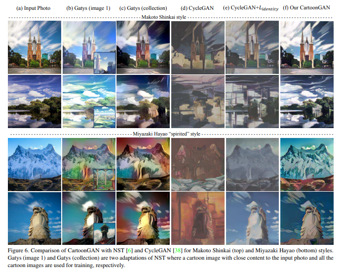
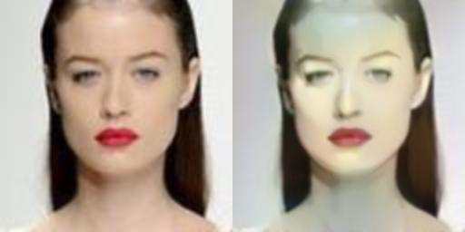

# pytorch-CartoonGAN
Pytorch implementation of CartoonGAN [1]
 * Parameters without information in the paper were set arbitrarily.
 * I used face-cropped celebA (src) and anime (tgt) collected from the web data because I could not find the author's data.
## tensorflow version
[CartoonGAN-tensorflow](https://github.com/taki0112/CartoonGAN-Tensorflow)

## Resutls
### paper results


### celebA2anime face
* Initialization phase (reconstruction)
<table align='center'>
<tr align='center'>
<td> Input - Result </td>
</tr>
<tr>
<td>
</tr>
<tr>
<td>
</tr>
<tr>
<td>
</tr>
</table>

* Catoonization
<table align='center'>
<tr align='center'>
<td> Input - Result </td>
</tr>
<tr>
<td>
</tr>
<tr>
<td>
</tr>
<tr>
<td>
</tr>
<tr>
<td>
</tr>
<tr>
<td>
</tr>
</table>


## Folder structure
The following shows basic folder structure.
```
├── data
│   ├── src_data # src data (not included in this repo)
│   │   ├── train 
│   │   └── test
│   └── tgt_data # tgt data (not included in this repo)
│       ├── train 
│       └── pair # edge-promoting results to be saved here
│
├── CartoonGAN.py # training code
├── edge_promoting.py
├── utils.py
├── networks.py
└── name_results # results to be saved here
```

## Development Environment

* NVIDIA GTX 1080 ti
* cuda 8.0
* python 3.5.3
* pytorch 0.4.0
* torchvision 0.2.1
* opencv 3.2.0

## Reference

[1] Chen, Yang, Yu-Kun Lai, and Yong-Jin Liu. "CartoonGAN: Generative Adversarial Networks for Photo Cartoonization." Proceedings of the IEEE Conference on Computer Vision and Pattern Recognition. 2018.

(Full paper: http://openaccess.thecvf.com/content_cvpr_2018/papers/Chen_CartoonGAN_Generative_Adversarial_CVPR_2018_paper.pdf)
