# pytorch-CartoonGAN
Pytorch implementation of CartoonGAN [1] (CVPR 2018)
 * Parameters without information in the paper were set arbitrarily.
 * I used face-cropped celebA (src) and anime (tgt) collected from the web data because I could not find the author's data.
 
## Tensorflow version
[CartoonGAN-tensorflow](https://github.com/taki0112/CartoonGAN-Tensorflow)

## Pytorch Lightning modules
The PT Lightning modules are cg_module and pretrain_generator. Tested with (a subset of ~1000 images each) these datasets:

- Source: [FFHQ Portraits](https://github.com/NVlabs/ffhq-dataset)
- Target: [High Res. Anime dataset](https://www.kaggle.com/subinium/highresolution-anime-face-dataset-512x512)
- Results:  
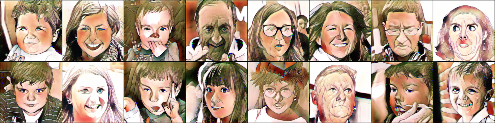
  
Usage:
Run CartoonGAN.py first to run edge promoting algorithm. Note that is has been extended to remove the black borders around anime faces for this dataset.
When the edge promoting has finished either continue running the old version or use run.py for the PytorchLightning version.

## Usage
### 1.Download VGG19
[VGG19](https://download.pytorch.org/models/vgg19-dcbb9e9d.pth)
### 2.Train
```
python CartoonGAN.py --name your_project_name --src_data src_data_path --tgt_data tgt_data_path --vgg_model pre_trained_VGG19_model_path
```
### Folder structure
The following shows basic folder structure.
```
├── data
│   ├── src_data # src data (not included in this repo)
│   │   ├── train 
│   │   └── test
│   └── tgt_data # tgt data (not included in this repo)
│       ├── train 
│       └── pair # edge-promoting results to be saved here
│
├── CartoonGAN.py # training code
├── edge_promoting.py
├── utils.py
├── networks.py
└── name_results # results to be saved here
```

## Resutls
### paper results
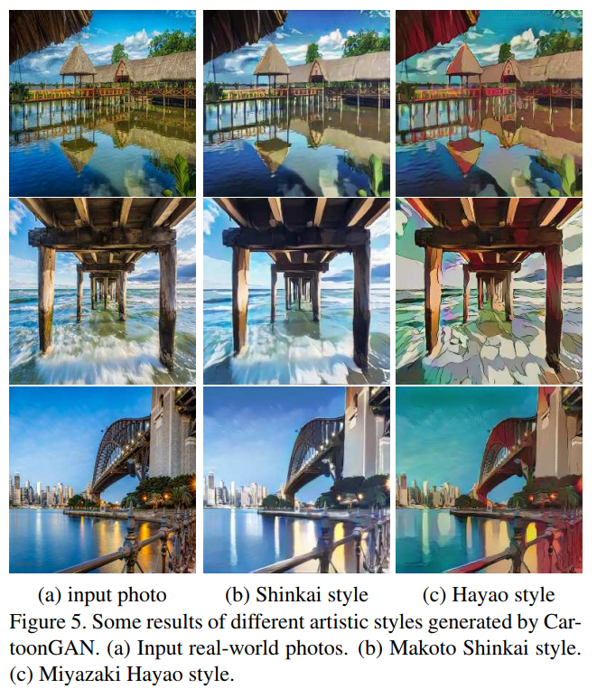


### celebA2anime face
### Initialization phase (reconstruction)
<table align='center'>
<tr align='center'>
<td> Input - Result (this repo) </td>
</tr>
<tr>
<td>
</tr>
<tr>
<td>
</tr>
<tr>
<td>
</tr>
</table>

### Cartoonization
* I got the author's results from [CaroonGAN-Test-Pytorch-Torch](https://github.com/Yijunmaverick/CartoonGAN-Test-Pytorch-Torch).
<table align='center'>
<tr align='center'>
<td> Input - Result (this repo) </td>
<td> Author's pre-trained model (Hayao) </td>
<td> Author's pre-trained model (Hosoda) </td>
</tr>
<tr>
<td>
<td>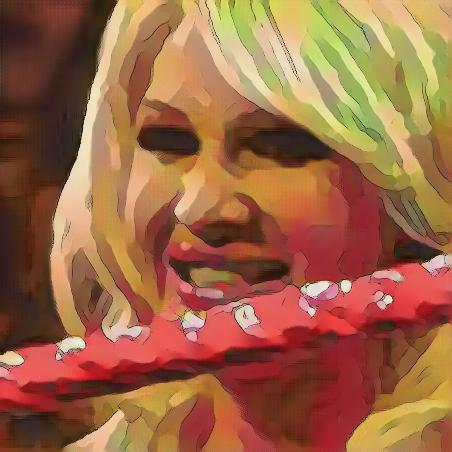
<td>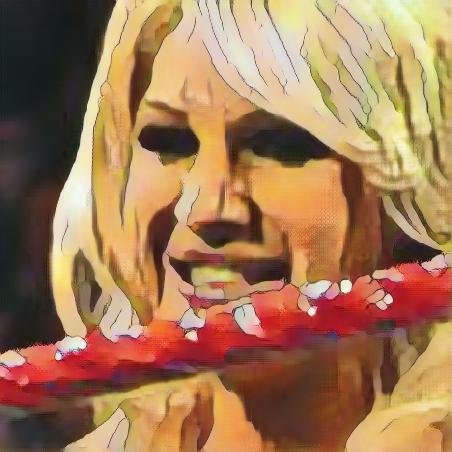
</tr>
<tr>
<td>
<td>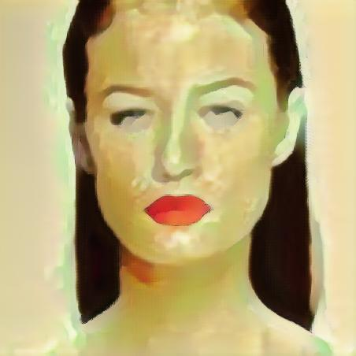
<td>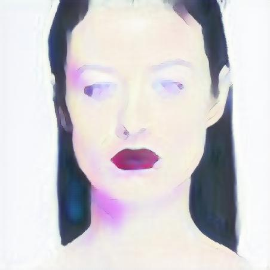
</tr>
<tr>
<td>
<td>
<td>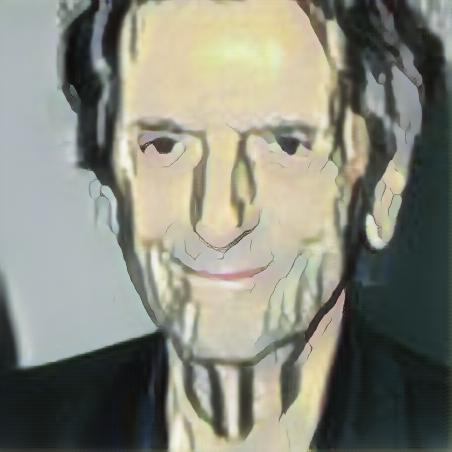
</tr>
<tr>
<td>
<td>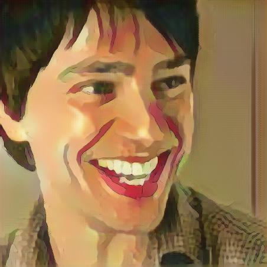
<td>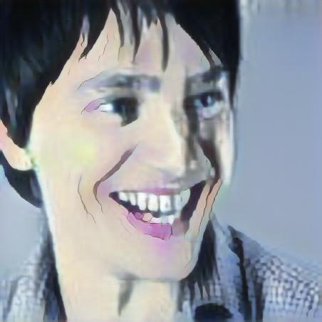
</tr>
<tr>
<td>
<td>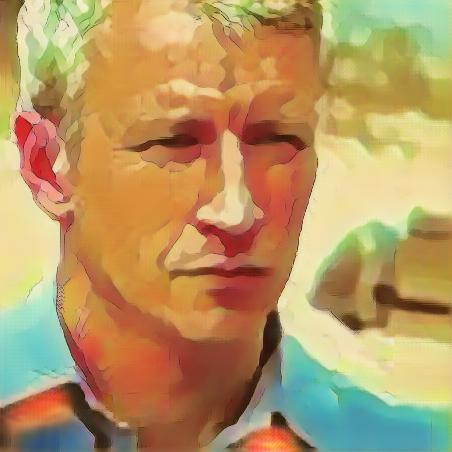
<td>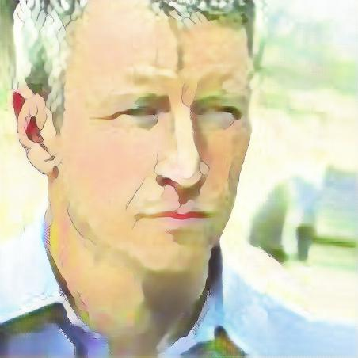
</tr>
</table>

## Development Environment

* NVIDIA GTX 1080 ti
* cuda 8.0
* python 3.5.3
* pytorch 0.4.0
* torchvision 0.2.1
* opencv 3.2.0

## Reference
[1] Chen, Yang, Yu-Kun Lai, and Yong-Jin Liu. "CartoonGAN: Generative Adversarial Networks for Photo Cartoonization." Proceedings of the IEEE Conference on Computer Vision and Pattern Recognition. 2018.

(Full paper: http://openaccess.thecvf.com/content_cvpr_2018/papers/Chen_CartoonGAN_Generative_Adversarial_CVPR_2018_paper.pdf)
